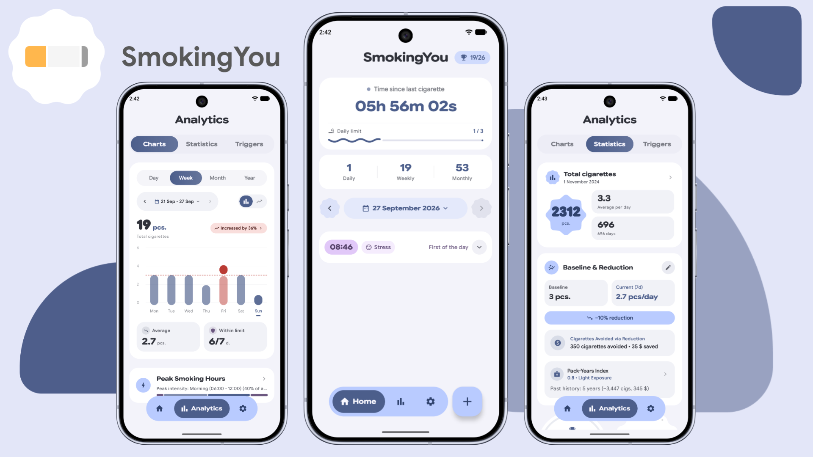
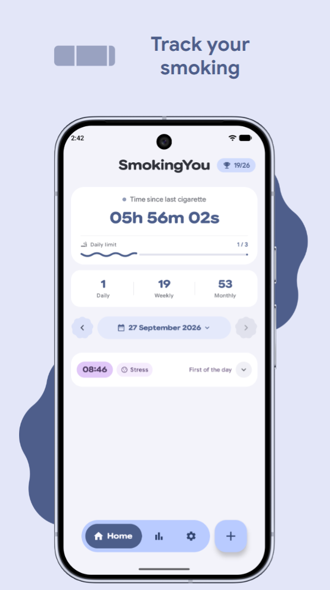
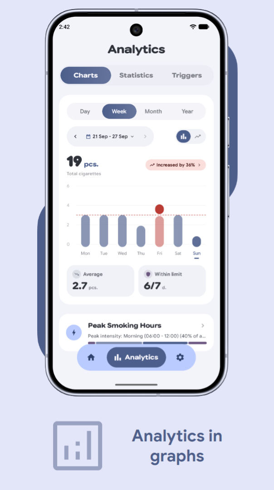
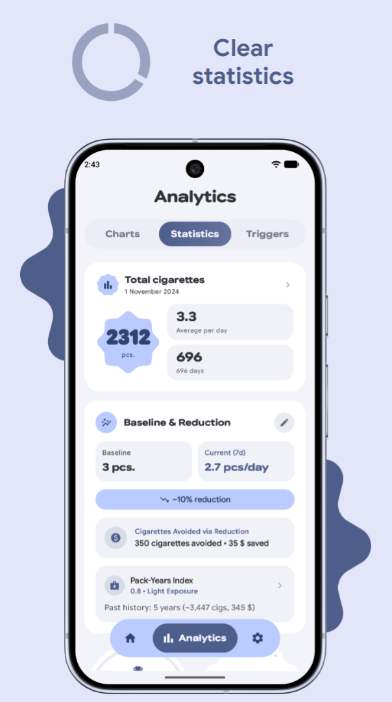
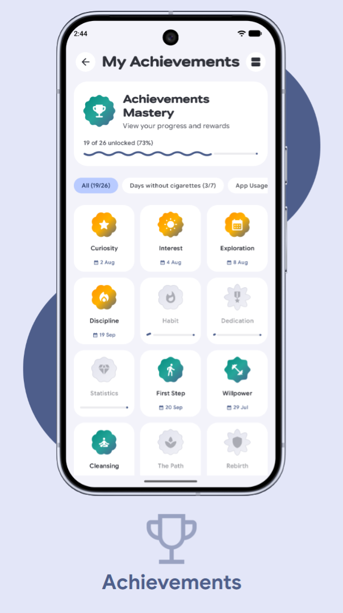
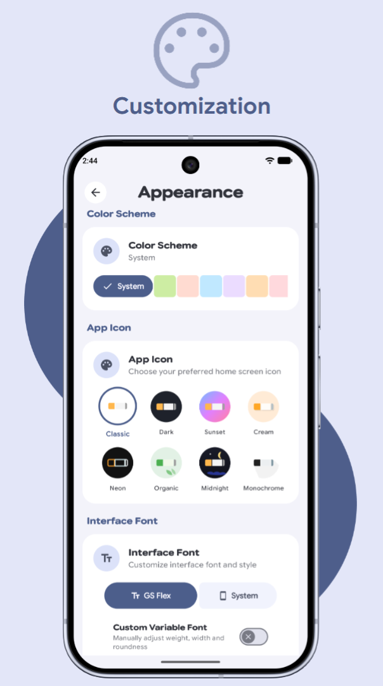
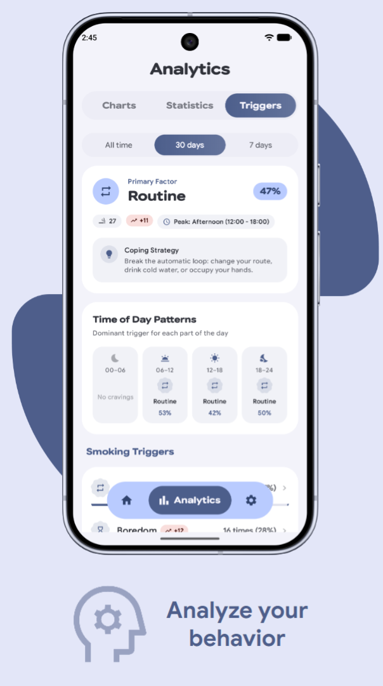

  

  # SmokingYou

  Minimalist, data-oriented smoking tracker for Android based on Material 3 Expressive.

  

    
    
    
    
    
    
  

  

    
    
    
    
  

  

    
  

  

    
  

---

SmokingYou is a private, modern, data-oriented smoking tracker designed to help you regain control over your habits. Built around the principles of Material 3 Expressive, the application provides live smoke-free timers, interactive speed dial logging, home screen widgets, ongoing status bar notifications, craving reduction techniques, trigger analytics, and comprehensive WHO health milestones — all completely offline with zero tracking.

## Screenshots

  
  

## Features

- **Habit Tracking:**
  - One-tap cigarette logging with a live timer showing elapsed time since your last smoke.
  - Multi-action Speed Dial FAB: quickly log a smoke with triggers, record a resisted craving, or launch a mindful pause.
  - Editable daily log history.
- **Home Screen Widgets:**
  - **Quick Add Widget (1x1):** One-tap instant cigarette logging from your home screen.
  - **Timer & Counter Widget (3x1):** Displays live smoke-free timer, daily count, limit status, and an optional quick-resist action button.
  - In-app widget setup with real-time previews and home screen pinning (Android 12+).
- **Ongoing Status Bar Notification:**
  - Persistent notification with an active smoke-free chronometer, daily limit progress, and today's resisted cravings count.
  - Quick action buttons to log a smoke or record a resisted craving directly from the notification shade.
- **Mindful Craving Pause:**
  - Guided breathing exercise to help ride out acute cravings.
  - Dedicated log for resisted cravings to track your willpower over time.
- **Trigger Management:**
  - Track common triggers (Stress, Coffee, Alcohol, Meals, Social, etc.) and create custom ones.
  - Actionable coping advice for each trigger and visual trigger distribution charts.
- **Smoking Baseline & Pack-Years:**
  - Compute your baseline smoking habit prior to using the app.
  - Pack-Years index calculation, past cigarette count, and estimated historical money spent.
- **Tapering Reduction Plan:**
  - Gradual reduction goals with customizable pace (Gentle, Moderate, Intensive).
  - Target cessation forecast projecting your quit date, with celebratory check-ins when staying within limits.
- **Detailed Analytics & Charts:**
  - Interactive Day, Week, Month, and Year views with rounded bars or smooth spline lines.
  - Target daily limit indicators and peak smoking hour distributions.
  - Monthly day-by-day table breakdown and average smoking intervals tracking.
- **WHO Health & Financial Stats:**
  - **12 WHO Recovery Milestones:** Detailed progress bars tracking health restoration based on WHO data.
  - **Savings Tracker & Goals:** Track money saved and set tangible goals with live progress bars.
  - Reclaimed life expectancy counter and smoke-free streak records.
- **Achievements System 2.0:**
  - Milestone and secret achievements with live progress bars, unlock dates, and switchable grid/list views.
- **Material 3 Expressive Design:**
  - Fluid spring animations (Bouncy Press) and rich tactile haptic feedback.
  - AMOLED True Dark Mode, Dynamic Colors (Material You) on Android 12+, 9 color presets, custom fonts, and dynamic app icons.
- **100% Private & Offline:**
  - No accounts, no cloud sync, no telemetry, no ads.
  - Fast local JSON backup and restore anytime.

## Tech Stack

- **Language:** [Kotlin](https://kotlinlang.org/) (Coroutines, Flow, StateFlow)
- **UI Framework:** [Jetpack Compose](https://developer.android.com/jetpack/compose) with Material 3 Expressive
- **Architecture:** Clean Architecture with screen-scoped ViewModels
- **Widgets:** Native Android AppWidget Framework (`AppWidgetProvider`, `RemoteViews`)
- **Data Persistence:** [Room Database](https://developer.android.com/training/data-storage/room) & [Jetpack DataStore](https://developer.android.com/topic/libraries/architecture/datastore)
- **Dependency Injection:** [Koin](https://insert-koin.io/)

## Localization

Currently supported languages (10):
- English
- Russian (Русский)
- German (Deutsch)
- Spanish (Español)
- French (Français)
- Italian (Italiano)
- Portuguese (Português)
- Turkish (Türkçe)
- Ukrainian (Українська)
- Chinese Simplified (中文)

## Installation

1. Download the latest APK from the [Releases](https://github.com/bodyaant/SmokingYou/releases/latest) page.
2. Ensure installation from unknown sources is allowed in your Android settings.
3. Install the APK on your device.

## Special Thanks

Special thanks to the following projects for design ideas and inspiration:
- **[Tomato](https://github.com/nsh07/Tomato)** and **[Zenith](https://github.com/1372Slash/Zenith)** - For beautiful interface concepts, Material 3 Expressive guideline implementation ideas, and design inspiration.

## Contributing

Contributions are welcome. If you find a bug or have a feature suggestion, please open an issue or submit a pull request.

## License

SmokingYou - Minimalist, data-oriented smoking tracker for Android.  
Copyright (C) 2026 bodyaant

This program is free software: you can redistribute it and/or modify it under the terms of the GNU General Public License as published by the Free Software Foundation, either version 3 of the License, or (at your option) any later version.

This program is distributed in the hope that it will be useful, but WITHOUT ANY WARRANTY; without even the implied warranty of MERCHANTABILITY or FITNESS FOR A PARTICULAR PURPOSE. See the GNU General Public License for more details.

You should have received a copy of the GNU General Public License along with this program. If not, see <https://www.gnu.org/licenses/>
